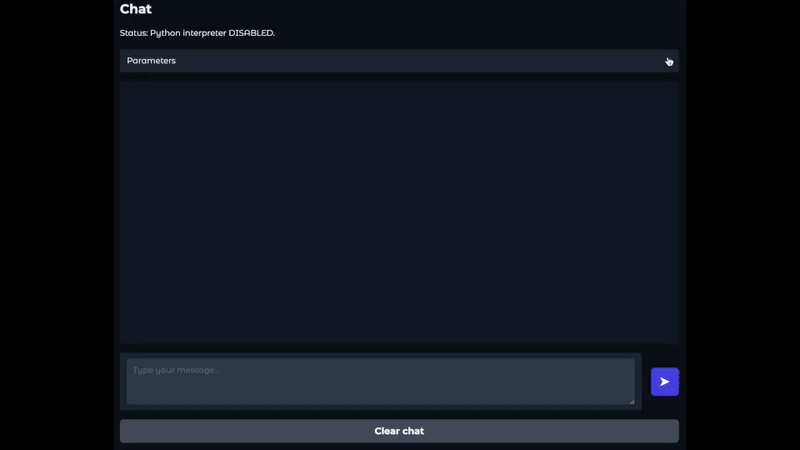

# Chat Interface

The chat interface provides a web UI where you can interactively chat with a deployed model. It supports features like multi-turn conversations and, for certain models like [OpenMath-Nemotron](https://huggingface.co/collections/nvidia/openmathreasoning-68072c0154a5099573d2e730), code execution capabilities.



## Launching

There are two main ways to launch the chat interface:
### 1. Via `ns start_server`

You can launch the chat interface alongside the model server directly on a cluster or remote machine using the `ns start_server` command:

```bash
ns start_server \
    --model Qwen/Qwen3-8B \
    --server_type vllm \
    --server_gpus 1 \
    --config local \
    --launch_chat_interface \
    [--extra_chat_args "<hydra_options_for_chat_ui>"]
```

### 2. Manual Launch

Alternatively, you can launch the chat interface manually if you have the `nemo_skills` environment installed locally. This method is suitable when you want to connect to an already running model server.

```bash
python -m nemo_skills.inference.chat_interface.launch server_type=vllm [other_hydra_options]
```
Replace `MODEL_CONFIG` with the path to your model's configuration (e.g., `model_config_path=/path/to/model/config.json`) and `SERVER_TYPE` with the type of server you are connecting to (e.g., `server_type=vllm`).

All relevant parameters for the chat interface, such as the model details, server endpoint, and UI elements, can be configured via Hydra command-line arguments. For a comprehensive list of configurable parameters, please refer to the configuration schema in `nemo_skills/inference/chat_interface/core.py`.


When launched this way, the chat interface will run on the same node as the model server.

#### Accessing the Interface (Cluster/Remote Launch)

To access the chat interface when it's launched via `ns start_server` on a remote machine or cluster, you'll need to set up an SSH tunnel to forward the port (default is `7860`) from the remote machine to your local machine.

*   **For Slurm clusters:**
    Use the following command, replacing `cluster` with the slurm cluster hostname or IP address, `username` with your username, and `node-name` with the name of the node where the server is running:
    ```bash
    ssh -J cluster -N -f -L localhost:7860:localhost:7860 username@node-name
    ```

*   **For remote workstations/servers:**
    Use the following command, replacing `username` with your username and `server` with the hostname or IP address of the remote machine:
    ```bash
    ssh -N -f -L localhost:7860:localhost:7860 username@server
    ```

Once the tunnel is established, you can access the interface by navigating to `http://localhost:7860` in your web browser.
