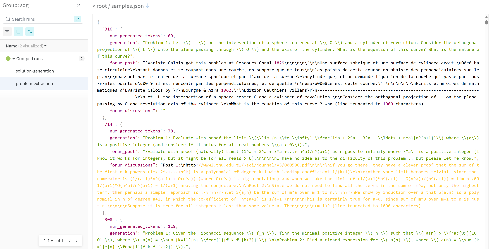
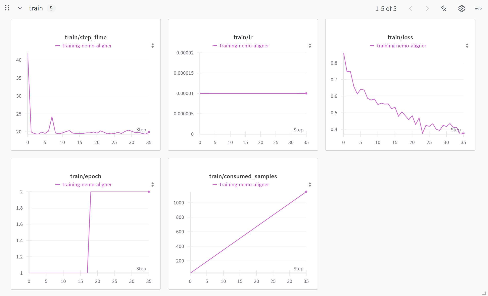
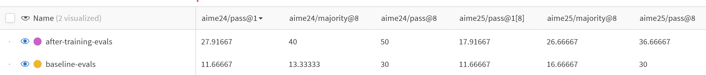

# A Simple Pipeline to Improve Math Reasoning Accuracy

This tutorial walks you through a simplified version of the pipeline that we used to win the [AIMO2 Kaggle competition](https://www.kaggle.com/competitions/ai-mathematical-olympiad-progress-prize-2/leaderboard).
We will start with [Qwen2.5-14B-Instruct](https://huggingface.co/Qwen/Qwen2.5-14B-Instruct) model that only scores ~10% on AIME24 benchmark and improve it to ~30% through a series of NeMo-Skills jobs.

If you’re following along, you’ll need access to either an NVIDIA DGX box with eight NVIDIA A100 (or newer) GPUs or a Slurm cluster with similarly configured nodes. All commands should only take ~2 hours to run.

<!-- more -->


You can also watch a video version of this tutorial.

<div style="position: relative; width: 100%; padding-bottom: 56.25%; height: 0;">
  <iframe
    src="https://www.youtube.com/embed/rwpsofHdAOo?si=fi0rm_-A3-N3q5Jz"
    style="position: absolute; top: 0; left: 0; width: 100%; height: 100%;"
    frameborder="0"
    allow="accelerometer; autoplay; clipboard-write; encrypted-media; gyroscope; picture-in-picture; web-share"
    referrerpolicy="strict-origin-when-cross-origin"
    allowfullscreen>
  </iframe>
</div>


## Setup

To orchestrate complex jobs, NeMo-Skills uses Docker containers. You’ll need to install [NVIDIA Container Toolkit](https://docs.nvidia.com/datacenter/cloud-native/container-toolkit/latest/install-guide.html) if running locally or use a Slurm cluster that supports [NVIDIA/pyxis](https://github.com/NVIDIA/pyxis). In both cases, it’s recommended that you set up NeMo-Skills on a local workstation and configure it to access your Slurm cluster through ssh. It will take care of uploading your code and scheduling jobs.

Run the following commands locally to complete the setup:

```shell
pip install git+https://github.com/NVIDIA/NeMo-Skills.git
ns setup
```

When prompted to add mounts, define a folder as `/workspace`. This folder will be used in subsequent commands. For more details, see the [NeMo-Skills configs](https://nvidia.github.io/NeMo-Skills/basics/cluster-configs/) documentation.

In the following sections, we will always use commands with `--cluster=local` argument which you’d need to change to `--cluster=slurm` (or whatever you named the config during the setup process) if running on Slurm. When using Slurm, all commands will finish immediately and schedule jobs in the cluster queue.

[Weights & Biases (W&B)](https://wandb.ai/site/) will be used for convenient logging of evaluation results and model outputs. You can disable this by removing all W&B related arguments from the commands.

## Baseline Evaluation

To start, let's first evaluate the original model to see where it stands. We will use [Qwen2.5 14B Instruct](https://huggingface.co/Qwen/Qwen2.5-14B-Instruct) and measure results on [AIME24 and AIME25](https://artofproblemsolving.com/wiki/index.php/AIME_Problems_and_Solutions) benchmarks.
In this case let's use vllm as an inference library.

```shell
# download the model
ns run_cmd --expname=download-14b --log_dir=/workspace/Qwen2.5-14B-Instruct --cluster=local \
    huggingface-cli download Qwen/Qwen2.5-14B-Instruct --local-dir /workspace/Qwen2.5-14B-Instruct
# prepare benchmark data
ns prepare_data aime24 aime25
# launch evaluation
ns eval \
    --cluster=local \
    --expname=baseline-eval \
    --run_after=download-14b \
    --model=/workspace/Qwen2.5-14B-Instruct \
    --server_type=vllm \
    --server_gpus=8 \
    --benchmarks=aime24:8,aime25:8 \
    --output_dir=/workspace/evals/baseline
# summarize results, after the evaluation job is done
ns summarize_results --cluster=local /workspace/evals/baseline --wandb_name=baseline-evals
```

The `ns eval` command will run eight generations for each sample in aime24/25 benchmarks and `summarize_results` will report an average pass@1, pass@8, and majority@8 metrics.

```
--------------------------------- aime24 ---------------------------------
evaluation_mode  | num_entries | avg_tokens | symbolic_correct | no_answer
pass@1[avg-of-8] | 30          | 865        | 15.83%           | 1.67%
majority@8       | 30          | 865        | 20.00%           | 0.00%
pass@8           | 30          | 865        | 36.67%           | 0.00%


--------------------------------- aime25 ---------------------------------
evaluation_mode  | num_entries | avg_tokens | symbolic_correct | no_answer
pass@1[avg-of-8] | 30          | 871        | 12.50%           | 0.42%
majority@8       | 30          | 871        | 20.00%           | 0.00%
pass@8           | 30          | 871        | 33.33%           | 0.00%
```

Note that you might not get exactly the same numbers because of the stochastic nature of LLM generations. You can read more about `ns eval` pipeline options in the [evaluation](https://nvidia.github.io/NeMo-Skills/pipelines/evaluation/) documentation.

## Synthetic Data Generation

To improve on the established baseline, let's generate some synthetic mathematical data. Following the [OpenMathReasoning recipe](https://nvidia.github.io/NeMo-Skills/openmathreasoning1/), we will use a small set of [AoPS forum discussions](https://artofproblemsolving.com/community) and extract problems from them using the same Qwen2.5-14B-Instruct model. We will then generation the new "long reasoning" solutions using [QwQ-32B](https://huggingface.co/Qwen/QwQ-32B). These problem-solution pairs will be used for training.

This simplified pipeline is very basic and misses multiple important steps (extracting ground-truth answers and filtering for correctness, for example). However, it should be enough to teach the 14B model how to use long reasoning and significantly improve the baseline results.

Let's start by downloading the data, as well as the problem extraction prompt and postprocessing script:

```shell
ns run_cmd --expname=prepare-data --log_dir=/workspace/prepare-data --cluster=local \
    'cd /workspace && \
    export DOWNLOAD_PREFIX=https://raw.githubusercontent.com/NVIDIA/NeMo-Skills/refs/heads/main/recipes/openmathreasoning && \
    wget $DOWNLOAD_PREFIX/scripts/prepare_raw_data.py && \
    wget $DOWNLOAD_PREFIX/prompts/extract-problems.yaml && \
    wget $DOWNLOAD_PREFIX/scripts/postprocess_problem_extraction.py && \
    python prepare_raw_data.py && \
    head -n 1000 raw_aops_data.jsonl > data.jsonl'
```

The fields from the data.jsonl will be used to fill the prompt in [extract-problems.yaml](https://github.com/NVIDIA/NeMo-Skills/blob/main/recipes/openmathreasoning/prompts/extract-problems.yaml), and this final prompt will be passed to an LLM. To learn more, you can inspect the data file and prompt script. For more details about prompt format, see the [prompts](https://nvidia.github.io/NeMo-Skills/basics/prompt-format/) documentation.

Next, run the [generation pipeline](https://nvidia.github.io/NeMo-Skills/pipelines/generation/) using the [Python API](https://nvidia.github.io/NeMo-Skills/pipelines/#python-interface):

```py
# run_sdg.py
from nemo_skills.pipeline.cli import generate, wrap_arguments

cluster = "local"
num_gpus = 8

postprocess_cmd = (
    f"python /workspace/postprocess_problem_extraction.py "
    f"    /workspace/sdg/problems/output.jsonl "
    f"    /workspace/sdg/extracted-problems.jsonl "
)

generate(
    ctx=wrap_arguments(
        f"++prompt_config=/workspace/extract-problems.yaml "
    ),
    cluster=cluster,
    input_file="/workspace/data.jsonl",
    output_dir="/workspace/sdg/problems",
    postprocess_cmd=postprocess_cmd,
    expname="problem-extraction",
    run_after=["prepare-data", "download-14b"],
    model="/workspace/Qwen2.5-14B-Instruct",
    server_type="vllm",
    server_gpus=num_gpus,
    # remove these parameters to disable wandb logging
    log_samples=True,
    wandb_group="sdg",
)
```

You can inspect sdg/extracted-problems.yaml to see the outputs. There should be a new field containing the extracted problems. Let's use the QwQ-32B model to generate solutions to these problems.

Add the following code to the end of sdg.py script and rerun it. By default, it will skip the problem extraction step (if it’s complete) because NeMo-Skills can detect if the generation has already finished.

```py
generate(
    ctx=wrap_arguments(
        f"++prompt_config=generic/math "
        f"++inference.temperature=0.6 "
        f"++inference.tokens_to_generate=8192 "
    ),
    cluster=cluster,
    input_file="/workspace/sdg/extracted-problems.jsonl",
    output_dir="/workspace/sdg/solutions",
    expname="solution-generation",
    run_after="problem-extraction",
    model="/workspace/QwQ-32B",
    server_type="trtllm",
    server_gpus=num_gpus,
    # remove these parameters to disable wandb logging
    log_samples=True,
    wandb_group="sdg",
)
```

It might take a few hours for this job to complete. If you’re able to run on multiple nodes in a Slurm cluster, you can parallelize it across N independent jobs by adding `num_chunks=N`. You can learn more about this and other parameters in the [generation](https://nvidia.github.io/NeMo-Skills/pipelines/generation/) documentation.

If you have W&B logging enabled, you can inspect generations there as shown on the picture below.



You can find the page by opening one experiment, switching to the Files tab, and clicking on samples.json.

## Model Training

With the synthetic data generated, you can use it to fine-tune the model. The following sections will show how to use either [NeMo-Aligner](https://github.com/NVIDIA/NeMo-Aligner/) or [NeMo-RL](https://github.com/NVIDIA/NeMo-RL) to do this.

First, prepare the data in the required format:

```shell
ns run_cmd --log_dir=/workspace/prepare-sft-data --expname=prepare-sft-data --run_after=solution-generation --cluster=local \
    'python -m nemo_skills.training.prepare_data \
      ++input_files=/workspace/sdg/solutions/output.jsonl \
      ++output_path=/workspace/sft-data.jsonl \
      ++prompt_config=generic/math \
      ++tokenizer=Qwen/Qwen2.5-32B-Instruct \
      ++filters.remove_contaminated=false \
      ++add_unlabeled=true \
      ++filters.remove_no_think_tags=true \
      ++filters.trim_solutions=false'
```

Next, [convert the model](https://nvidia.github.io/NeMo-Skills/pipelines/checkpoint-conversion/) to NeMo format. You can skip this step for NeMo-RL training.

```shell
ns convert \
    --cluster=local \
    --expname=convert-14b-nemo \
    --run_after=download-14b \
    --input_model=/workspace/Qwen2.5-14B-Instruct \
    --output_model=/workspace/qwen2.5-14b-instruct-nemo \
    --convert_from=hf \
    --convert_to=nemo \
    --num_gpus=8 \
    --model_type=qwen \
    --hf_model_name=Qwen/Qwen2.5-14B-Instruct
```

For the NeMo-Aligner backend, use the following training command. Add `--disable_wandb` to disable W&B logging.

```shell
ns train \
    --cluster=local \
    --expname=training \
    --run_after=convert-14b-nemo \
    --run_after=prepare-sft-data \
    --output_dir=/workspace/training \
    --nemo_model=/workspace/qwen2.5-14b-instruct-nemo \
    --num_nodes=1 \
    --num_gpus=8 \
    --training_data=/workspace/sft-data.jsonl \
    ++model.data.train_ds.max_seq_length=8192 \
    ++model.data.train_ds.global_batch_size=32 \
    ++model.tensor_model_parallel_size=4 \
    ++model.context_parallel_size=2 \
    ++model.optim.lr=1e-5 \
    ++trainer.sft.max_epochs=2
```

For the NeMo-RL backend, use the following training command. Add `--disable_wandb` to disable W&B logging. Only run one of the training commands, not both (or change the paths and `expnames` accordingly).

```shell
ns nemo_rl sft \
    --cluster=local \
    --expname=training \
    --run_after=download-14b \
    --run_after=prepare-sft-data \
    --output_dir=/workspace/training \
    --hf_model=/workspace/Qwen2.5-14B-Instruct \
    --num_nodes=1 \
    --num_gpus=8 \
    --training_data=/workspace/sft-data.jsonl \
    --backend=fsdp \
    --final_hf_path=/workspace/training/qwen2.5-14b-improved-hf \
    ++sft.max_num_epochs=4 \
    ++policy.dtensor_cfg.tensor_parallel_size=8 \
    ++policy.max_total_sequence_length=8192 \
    ++policy.train_global_batch_size=32 \
    ++policy.optimizer.kwargs.lr=1e-5 \
    ++policy.dtensor_cfg.sequence_parallel=true \
    ++policy.dtensor_cfg.activation_checkpointing=true
```

To learn more about SFT configuration, see the [NeMo-Skills training](https://nvidia.github.io/NeMo-Skills/pipelines/training/) documentation. If you have W\&B logging enabled, you can inspect the training metrics there.



## Final Evaluation

To check model improvement, let's run another evaluation. Convert the checkpoint back into Hugging Face format for faster evaluation. You can skip the conversion step if you’re using the NeMo-RL backend for training.

```shell
# converting back to HF format
ns convert \
   --cluster=local \
   --expname=convert-14b-hf \
   --run_after=training \
   --input_model=/workspace/training/model-averaged-nemo \
   --output_model=/workspace/training/qwen2.5-14b-improved-hf \
   --convert_from=nemo \
   --convert_to=hf \
   --num_gpus=8 \
   --model_type=qwen \
   --hf_model_name=Qwen/Qwen2.5-14B-Instruct
# launching evaluation
ns eval \
    --cluster=local \
    --expname=final-eval \
    --run_after=convert-14b-hf \
    --run_after=training \
    --model=/workspace/training/qwen2.5-14b-improved-hf \
    --server_type=vllm \
    --server_gpus=8 \
    --benchmarks=aime24:8,aime25:8 \
    --output_dir=/workspace/evals/after-training \
    ++inference.tokens_to_generate=16384
# summarize results, after the evaluation job is done
ns summarize_results --cluster=local /workspace/evals/after-training --wandb_name=after-training-evals
```

This evaluation should show good improvements for both benchmarks.

```
--------------------------------- aime24 ---------------------------------
evaluation_mode  | num_entries | avg_tokens | symbolic_correct | no_answer
pass@1[avg-of-8] | 30          | 13262      | 23.33%           | 60.42%
majority@8       | 30          | 13262      | 36.67%           | 23.33%
pass@8           | 30          | 13262      | 50.00%           | 23.33%


--------------------------------- aime25 ---------------------------------
evaluation_mode  | num_entries | avg_tokens | symbolic_correct | no_answer
pass@1[avg-of-8] | 30          | 13244      | 16.25%           | 65.42%
majority@8       | 30          | 13244      | 20.00%           | 30.00%
pass@8           | 30          | 13244      | 30.00%           | 30.00%
```

You can also see it in the W&B dashboard. Switch to the Runs panel and click on Columns to customize the displayed metrics.



## What's next?

With NeMo-Skills, you can easily build sophisticated pipelines by connecting the various stages needed to improve LLM abilities. This enables you to seamlessly switch between different training and inference frameworks. All the commands used in this tutorial can be combined into a [single script](https://github.com/NVIDIA/NeMo-Skills/blob/main/recipes/openmathreasoning/scripts/simplified_recipe.py) that schedules the entire job. With just one line change, you can transition from quick prototyping on your local workstation to large-scale experiments on a Slurm cluster.

As an exercise, try adding the extra filtering steps mentioned in the [OpenMathReasoning documentation](https://nvidia.github.io/NeMo-Skills/openmathreasoning1/dataset/). You can also try generating multiple solutions per problem and check how this affects final evaluation results. As you will see, having a single script that runs everything—from data generation to model training to evaluation—makes it very easy to iterate on changes to any part of the pipeline.
